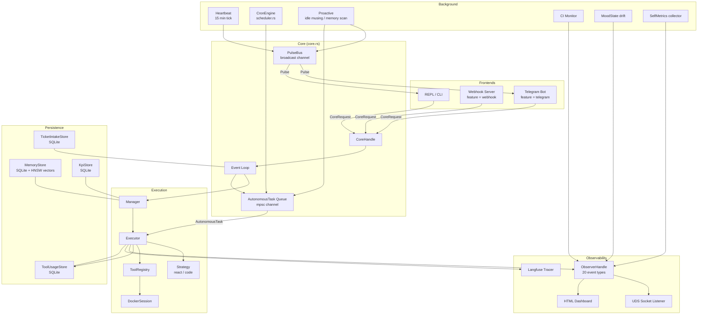

<div align="center">


**Self-hosted multi-agent orchestrator with a hardened execution sandbox,<br>
semantic memory, and deep observability — built in Rust.**

[](https://github.com/Enreign/athena/actions/workflows/maintainability.yml)
[](LICENSE)
[](https://www.rust-lang.org)
[](CHANGELOG.md)
[](CHANGELOG.md)


<!-- run `vhs scripts/demo.tape` to regenerate -->

</div>

---

## What is Athena?

> [!WARNING]
> **Early development.** Athena is actively developed and the internals change frequently. Expect rough edges, incomplete features, and breaking changes between versions. Bug reports and PRs are welcome.

Athena is a **self-hosted Rust multi-agent system** built as a portfolio/learning project to explore the hard parts of autonomous agent architecture: sandboxed execution, semantic memory, multi-agent routing, LLM orchestration, and observability. It is not a SaaS product or a startup — it exists because building these subsystems from scratch is the fastest way to understand them.

Named sub-agents called **ghosts** run inside hardened Docker containers and execute tasks using configurable tool sets and execution strategies. A classifier model routes tasks to the right ghost, informed by historical KPI outcomes. A persistent memory layer with ONNX embeddings and recency decay accumulates cross-session context. External tools are wired in via an MCP client registry with namespaced tool exposure and allowlist controls. A structured observability stack — event streams, Langfuse traces, KPI snapshots, and a `doctor` diagnostic command — makes system behavior inspectable at every level.

---

## Why Athena?

| | Athena | Typical self-hosted agent |
|---|---|---|
| **Sandbox hardening** | CAP_DROP ALL, read-only rootfs, SSRF/path-traversal blocking, PID+memory limits | Docker run with default caps |
| **Memory** | ONNX embeddings locally, HNSW index, recency decay, FTS5, deduplication | None, or external embedding API |
| **Observability** | 20-type event stream, Langfuse traces, KPI snapshots, `doctor` command, HTML dashboard | stdout logs |
| **Safety model** | 5-level autonomy ladder, prompt scanner, loop guard, per-ghost tool allowlists | Trust the LLM |
| **Self-improvement** | Eval harness, optimizer tournament, supervised self-build, KPI-driven ghost selection | None |

---

## What's New

Recent additions — see [CHANGELOG.md](CHANGELOG.md) for the full list:

- **HNSW semantic memory index** — approximate nearest-neighbor search with exact-cosine fallback
- **MCP ToolRegistry** — connect any MCP server via config; tools exposed as `mcp:<server>:<tool>`
- **OpenAI-compatible API** — `/v1/models` and `/v1/chat/completions` for IDE/client integrations
- **Ghost auto-specialization** — autonomous routing driven by historical KPI success rates
- **Session review & explainability** — activity log with Telegram `/review`, `/explain`, `/watch`, `/alerts`
- **Prompt scanner** — input-layer safety hardening with `flag_only`/`block` modes and allowlist overrides

---

## Table of Contents

- [Quick Start](#quick-start)
- [Features](#features)
  - [Execution & Sandboxing](#execution--sandboxing)
  - [Memory & Learning](#memory--learning)
  - [Multi-Agent Architecture](#multi-agent-architecture)
  - [Planning & Orchestration](#planning--orchestration)
  - [MCP Integration](#mcp-integration)
  - [Safety & Intake Hardening](#safety--intake-hardening)
  - [Observability & Diagnostics](#observability--diagnostics)
  - [OpenAI-Compatible API](#openai-compatible-api)
  - [Configuration & Runtime Control](#configuration--runtime-control)
  - [Proactive & Personality](#proactive--personality-experimental)
  - [What Athena Does Not Do (Yet)](#what-athena-does-not-do-yet)
- [Architecture](#architecture)
- [CLI Reference](#cli-reference)
- [Configuration](#configuration)
- [Documentation](#documentation)
- [Examples](#examples)
- [CI](#ci)
- [Contributing](#contributing--security--license)

---

## Quick Start

```bash
# 1. Clone
git clone https://github.com/Enreign/athena.git && cd athena

# 2. Configure
cp config.example.toml config.toml
# Edit config.toml: set [llm] provider and credentials

# 3. Verify
cargo check -q
cargo test -q
cargo run --quiet -- doctor --skip-llm

# 4. Chat
cargo run -- chat
```

> **Deterministic local mode** (no `~/.athena` overrides, no LLM required for listing):
> ```bash
> ATHENA_DISABLE_HOME_PROFILES=1 cargo run -- ghosts
> ```

Fully local deployment profile + verification: [`docs/local-only-deployment.md`](docs/local-only-deployment.md)

---

## Features

### Execution & Sandboxing

Athena's Docker sandbox applies layered hardening beyond a typical `docker run`:

- **CAP_DROP ALL** — all Linux capabilities dropped from every ghost container
- **Read-only root filesystem** — containers cannot modify their own image
- **Network isolation** — disabled by default inside containers
- **PID limit (256) and memory cap** — per-container resource limits enforced by the daemon
- **Tool input validation** — every tool call is checked before execution:
  - Path traversal blocked (`../` patterns rejected)
  - SSRF blocked (localhost, private IP ranges, IPv6 loopback, link-local)
  - Sensitive file access blocked (`.env`, `*.pem`, `credentials.json`, and configurable patterns)
- **CLI tool delegation** — dispatch tasks to Claude Code, Codex, or opencode running inside the sandbox
- **Tool-call loop guard** — circuit breaker that stops repeated identical tool-call loops mid-execution

### Memory & Learning

- **ONNX embeddings** — 384-dimensional vectors generated locally (no external embedding API required)
- **HNSW semantic index** — approximate nearest-neighbor search with exact-cosine fallback for small/early datasets
- **FTS5 full-text search** — fast keyword retrieval alongside vector similarity
- **Recency decay** — configurable half-life weighting so stale context loses relevance over time
- **Deduplication** — cosine threshold check before storing prevents redundant accumulation
- **Cross-session persistence** — SQLite-backed; context survives restarts

### Multi-Agent Architecture

- **Ghost personas** — named agents (`coder`, `scout`, custom) each with their own tool set, strategy, and optional soul file (personality markdown)
- **KPI-driven ghost selection** — autonomous routing uses historical success/rollback rates per repo, lane, and risk tier rather than a static default
- **Classifier-based routing** — an LLM classifier analyzes each task and selects the appropriate ghost
- **Two execution strategies** — `react` (ReAct loop with observation steps) and `code` (optimized four-phase pipeline for multi-file edits)
- **Multi-phase pipeline** — EXPLORE → EXECUTE → VERIFY → HEAL phases per task
- **Async dispatch** — tasks run concurrently via an internal mpsc task queue
- **Docker isolation** — each ghost execution gets a fresh container; no shared state between runs
- **Custom profiles** — define new ghost types in `config.toml` or `~/.athena/ghosts/*.toml`

### Planning & Orchestration

- **Feature contracts** — TOML task specifications with acceptance criteria and dependency ordering
- **DAG execution** — tasks within a feature contract execute in topological order with cycle detection
- **Adaptive token budgeting** — pre-dispatch context budgeting for oversized task contracts
- **Verification phase** — contracts define acceptance criteria checked against task output
- **Rollback on failure** — individual ghost tasks roll back git commits on failure
- **Proactive refactoring scanner** — background process identifies improvement opportunities and dispatches tasks autonomously (with spontaneity gate)

### MCP Integration

- **Config-driven MCP registry** — connect any MCP-compatible server via `[[mcp.servers]]` in `config.toml`
- **Namespaced tool exposure** — discovered tools are exposed as `mcp:<server>:<tool>` with per-server allowlists
- **Confirmation propagation** — `requires_confirmation` flows through the normal tool approval path
- **`stdio` transport** — production-ready; `sse`/`websocket` config enum exists, rejected at runtime

### Safety & Intake Hardening

- **Prompt scanner** — input-layer scanner at chat and autonomous task intake with `flag_only`/`block` modes, severity-weighted scoring, and per-provider/repo overrides
- **Allowlist controls** — scanner bypasses configurable by ticket ID, repo, author, or regex text patterns
- **Bounded autonomy ladder** — 5-level safety model governing what ghosts may do autonomously

### Observability & Diagnostics

- **20-type event stream** — structured events emitted via Unix domain socket in real time: `Startup`, `Heartbeat`, `MoodChange`, `ToolUsage`, `PulseEmitted`, `AutonomousTask`, `CiMonitor`, and 13 more — all CI-enforced to have at least one emit site
- **Langfuse integration** — every LLM call, tool execution, and background task pipeline produces traces, spans, and generation metadata
- **KPI tracking** — task success rate, verification pass rate, rollback rate, mean time to fix — segmented by lane (`delivery` vs `self-improvement`), repository, and risk tier
- **Session review & explainability** — activity log persistence with Telegram commands (`/review`, `/explain`, `/watch`, `/search`, `/alerts`) for audit, replay, and pattern-based alerting
- **`doctor` command** — runs 4 diagnostic funnels: LLM connectivity, proactive feature wiring, memory pipeline health, execution environment readiness
- **Self-metrics introspection** — process-level RSS, CPU, error rate, and LLM latency collected and anomaly-detected at runtime
- **HTML eval dashboard** — `scripts/eval_dashboard.py` produces a self-contained dashboard from the local SQLite DB

### OpenAI-Compatible API

- **`/v1/models`** and **`/v1/chat/completions`** endpoints — drop-in for OpenAI-compatible clients and IDE plugins
- **Auth** — bearer token via env; rate limiting and structured error responses included
- **Documented deviations** — unsupported options (`stream`, function-calling) return explicit `400` with error JSON

### Configuration & Runtime Control

- **Deep runtime configuration** — 30+ knobs in `RuntimeKnobs` alone, plus per-section config (memory, mood, heartbeat, docker, manager); all tunable without restart:
  - Spontaneity level (controls autonomous initiative)
  - Quiet hours (timezone-aware pulse suppression during off-hours)
  - Heartbeat interval, pulse rate limit (4/hr for non-urgent)
  - Mood drift parameters, energy curve shape
  - Sensitive pattern blocklist, auto-approve patterns per ghost
- **LLM providers** — OpenAI, Ollama (local), OpenRouter, Zen — swap via config with no code changes
- **Cron scheduling** — POSIX cron, interval-with-jitter, and one-shot scheduling for background tasks
- **Secret management** — OS keyring via `athena secrets set <key>`; inline secrets in config are blocked by default

### Proactive & Personality (Experimental)

- **Mood system** — energy (0–1, time-of-day curve peaking 9–11am) and valence (positive/negative), 10 personality modifiers (curious, focused, playful, …) injected into system prompts
- **Idle musings** — samples memories when idle, generates reflections via LLM, schedules follow-up messages
- **Conversation re-entry** — autonomously resumes threads based on past context
- **Telegram front-end** — multi-step planning interview with inline keyboards; voice input via Telegram speech-to-text; quiet-hours-aware pulse delivery

### What Athena Does Not Do (Yet)

- **No IDE integration** — CLI and Telegram only
- **No git worktree workspace isolation** — parallel agents share the working tree; Docker-based isolation only
- **No visual dashboard / TUI** — CLI output and observer socket; no interactive terminal UI
- **No auto-merge by default** — PR creation uses `gh` CLI; CI monitoring exists but requires explicit `--monitor-ci`

---

## Architecture

<details>
<summary>Component diagram (click to expand)</summary>



</details>

Full architecture with state machines and data-flow diagrams: [`docs/architecture.md`](docs/architecture.md)

---

## CLI Reference

| Command | Description |
|---|---|
| `cargo run -- chat` | Start interactive REPL session |
| `cargo run -- ghosts` | List all configured ghost agents |
| `cargo run -- dispatch --goal "..." --wait-secs 120` | Dispatch a task and wait for completion |
| `cargo run -- doctor --skip-llm` | Run health checks (no LLM required) |
| `cargo run -- doctor --security` | Print security attestation |
| `cargo run -- kpi snapshot --lane delivery` | Print KPI snapshot for a lane |
| `cargo run -- dashboard --output-format html` | Generate observability dashboard |
| `cargo run -- feature --help` | Feature contract workflow help |
| `cargo run -- self-build --help` | Supervised self-build workflow help |
| `cargo run -- openai login` | OpenAI OAuth login for subscription-backed provider |
| `cargo run -- observe` | Stream observer events to stdout |
| `make user-flow` | Linear ticket intake + writeback harness |

---

## Configuration

Copy `config.example.toml` to `config.toml` and edit. Minimal example:

```toml
[llm]
provider = "openai"   # or "ollama" / "openrouter" / "zen"

[openai]
model = "gpt-4o"

[docker]
image        = "rust:1.84-slim"
runtime      = "runc"
memory_limit = 268435456   # 256 MiB per ghost container

[[ghosts]]
name        = "coder"
description = "Multi-file coding tasks."
tools       = ["file_read", "file_write", "shell", "git", "gh"]
strategy    = "code"
```

Secrets (API keys, tokens) go in a gitignored `.env` file or the OS keyring (`athena secrets set <key>`).
Inline credentials in `config.toml` are blocked by default. See [`config.example.toml`](config.example.toml) for all sections.

---

## Documentation

Full docs index: [`docs/README.md`](docs/README.md)

Key references:

- [Architecture diagrams](docs/architecture.md)
- [Feature contract workflow](docs/feature-contract-workflow.md)
- [Eval harness](docs/eval-harness.md)
- [Self-improvement roadmap](docs/self-improvement-roadmap.md)
- [OpenAI-compatible API](docs/openai-compatible-api.md)
- [MCP integration](docs/mcp-integration.md)
- [Session review & explainability](docs/session-review-explainability.md)
- [Ghost specialization policy](docs/ghost-specialization.md)
- [Prompt scanner](docs/prompt-scanner.md)
- [Local-only deployment](docs/local-only-deployment.md)
- [Security attestation](docs/security-attestation.md)

---

## Examples

Runnable examples in [`examples/`](examples/README.md):

- `basic-dispatch.sh` — copy config, run doctor, dispatch a task
- `feature-contract.toml` — annotated feature contract with all fields
- `custom-ghost.toml` — minimal ghost customization snippet

---

## CI

Main CI checks:

- `.github/workflows/maintainability.yml`
- `.github/workflows/eval-harness.yml`
- `.github/workflows/doctor.yml`

Real-gate and nightly optimizer workflows are intentionally self-hosted.

---

## Contributing · Security · License

[CONTRIBUTING.md](CONTRIBUTING.md) · [SECURITY.md](SECURITY.md) · [LICENSE](LICENSE) · [CHANGELOG.md](CHANGELOG.md)

Questions and bug reports → [GitHub Issues](https://github.com/Enreign/athena/issues)
