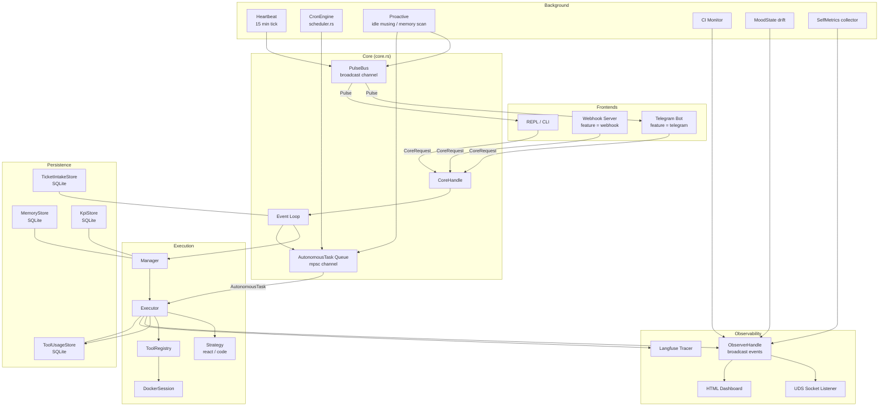
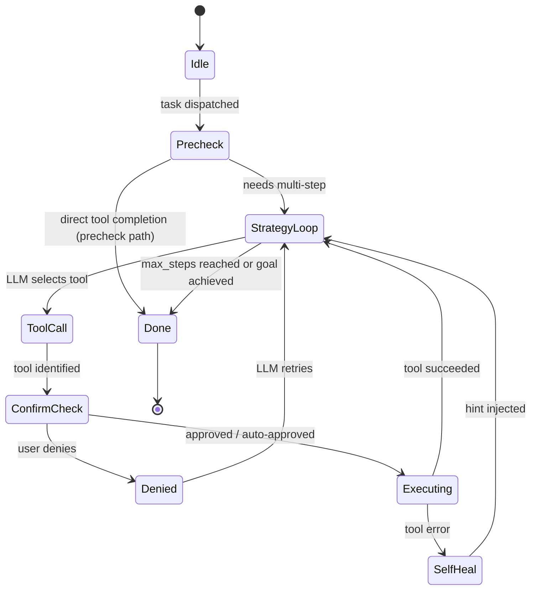
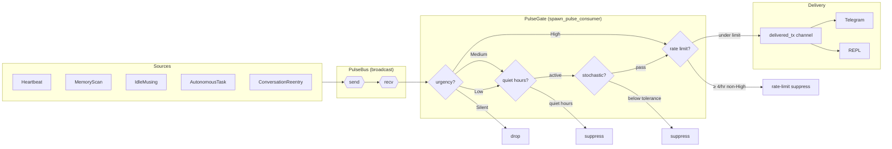
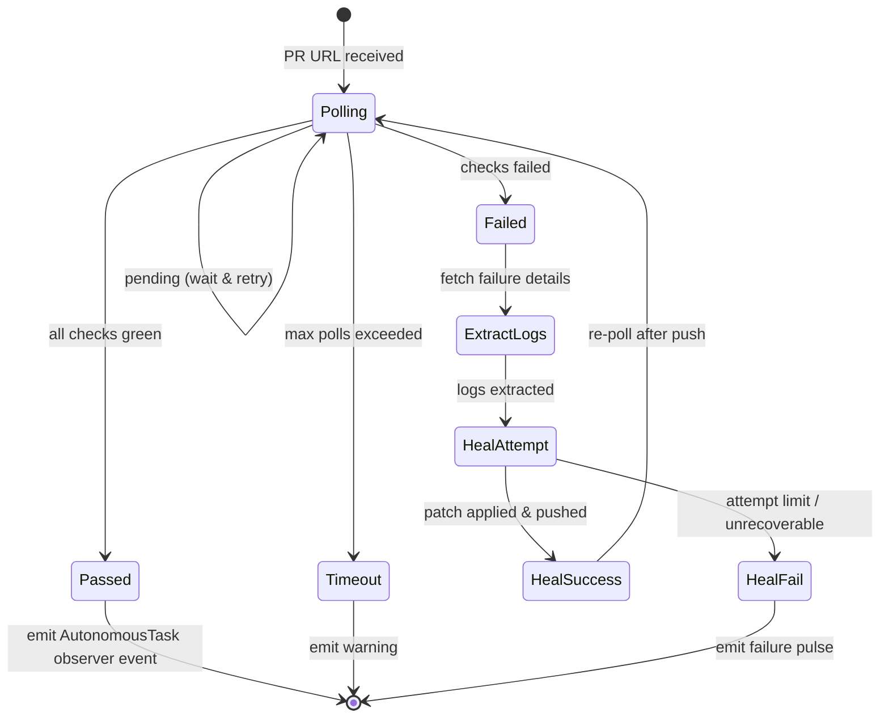
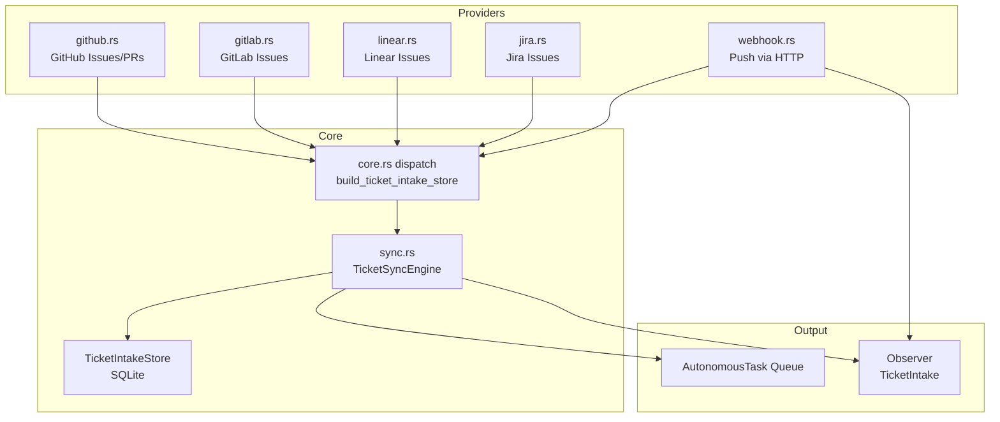
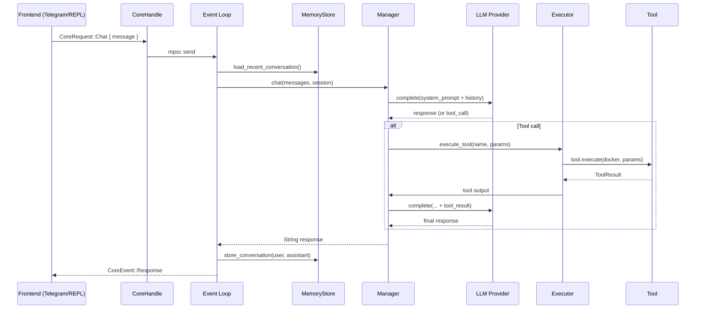

# Emberloom Architecture

System-level diagrams kept in sync with the codebase via `scripts/wiring_check.py`.
Wiring violations are caught on every CI run — any variant not wired will fail the gate.

Memory retrieval hot-path design and benchmark contract:
- `docs/memory-hot-path-lru.md`

---

## Component Overview

---

## Spark Execution State Machine

A spark is a named agent configuration. The Executor drives each task through this lifecycle:

---

## Pulse Delivery Pipeline

Pulses are proactive messages emitted by background tasks and delivered to frontends.

---

## CI Monitor State Machine

Triggered by `AutonomousTask` dispatch with type `CiMonitor`:

---

## Ticket Intake Pipeline

Four provider modules feed a common dispatch in `core.rs`:

---

## Observer Event Categories

All 20 categories must have at least one emit site — enforced by `scripts/wiring_check.py`:

| Category | Label | Emitted by |
|---|---|---|
| `Startup` | `STARTUP` | core.rs (init) |
| `KnobChange` | `KNOB` | main.rs, telegram.rs |
| `Heartbeat` | `HEARTBEAT` | heartbeat.rs, proactive.rs |
| `CronTick` | `CRON` | scheduler.rs |
| `MoodChange` | `MOOD` | mood.rs (drift) |
| `MemoryScan` | `MEMORY` | proactive.rs |
| `StochasticRoll` | `STOCHASTIC` | heartbeat.rs, proactive.rs |
| `PulseEmitted` | `PULSE+` | pulse.rs (consumer) |
| `PulseSuppressed` | `PULSE_X` | pulse.rs (consumer) |
| `PulseDelivered` | `PULSE_OK` | pulse.rs (consumer) |
| `IdleMusing` | `IDLE` | proactive.rs |
| `EnergyShift` | `ENERGY` | mood.rs (drift, delta ≥ 0.1) |
| `ChatIn` | `CHAT_IN` | core.rs (request) |
| `ChatOut` | `CHAT_OUT` | core.rs (response) |
| `AutonomousTask` | `AUTO_TASK` | core.rs, proactive.rs |
| `TicketIntake` | `TICKET` | core.rs, ticket_intake/ |
| `ToolUsage` | `TOOL_USE` | executor.rs (every tool call) |
| `ToolReload` | `TOOL_RELOAD` | dynamic_tools.rs |
| `SelfMetrics` | `SELF_METRICS` | introspect.rs |
| `CiMonitor` | `CI_MON` | ci_monitor.rs |

---

## Data Flow: Chat Request → Response

---

## Wiring Invariants (CI-enforced)

`scripts/wiring_check.py` validates on every PR:

1. **ObserverCategory** — every variant has ≥ 1 `observer.log(ObserverCategory::X, …)` call
2. **PulseSource** — every non-`#[cfg(test)]` variant appears in `Pulse::new(PulseSource::X, …)`
3. **LlmProvider** — every `impl LlmProvider for T` is referenced in `config.rs build_llm_provider_for`
4. **TicketIntake** — every provider module in `src/ticket_intake/` is referenced in `core.rs`
5. **PulseBus** — subscription path exists (consumer is active)
6. **Executor** — holds `ObserverHandle` and emits `ToolUsage`
7. **MoodState::drift** — emits `EnergyShift`
