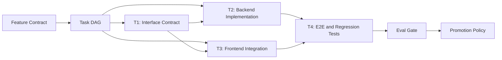
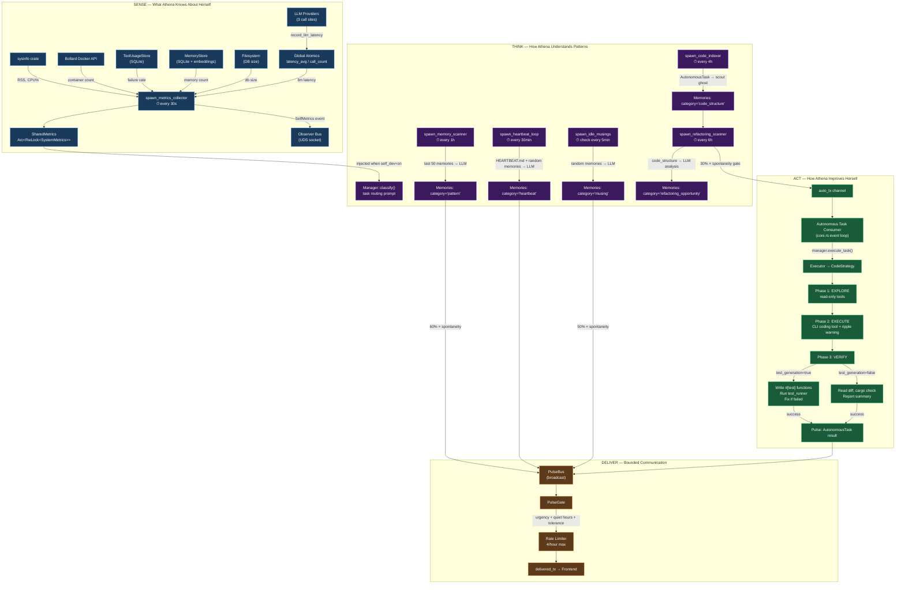
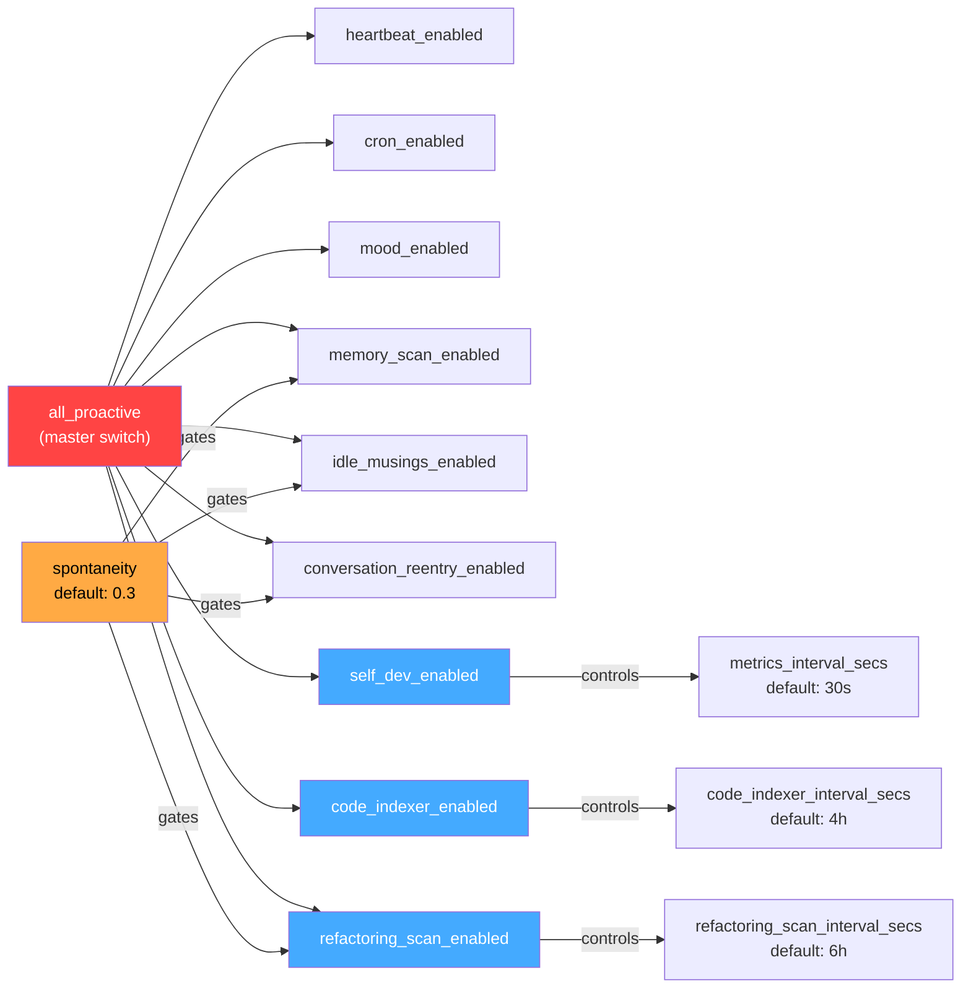
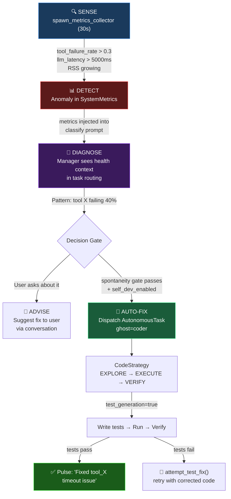
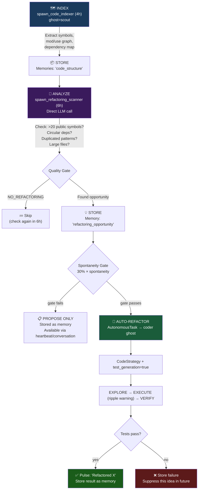
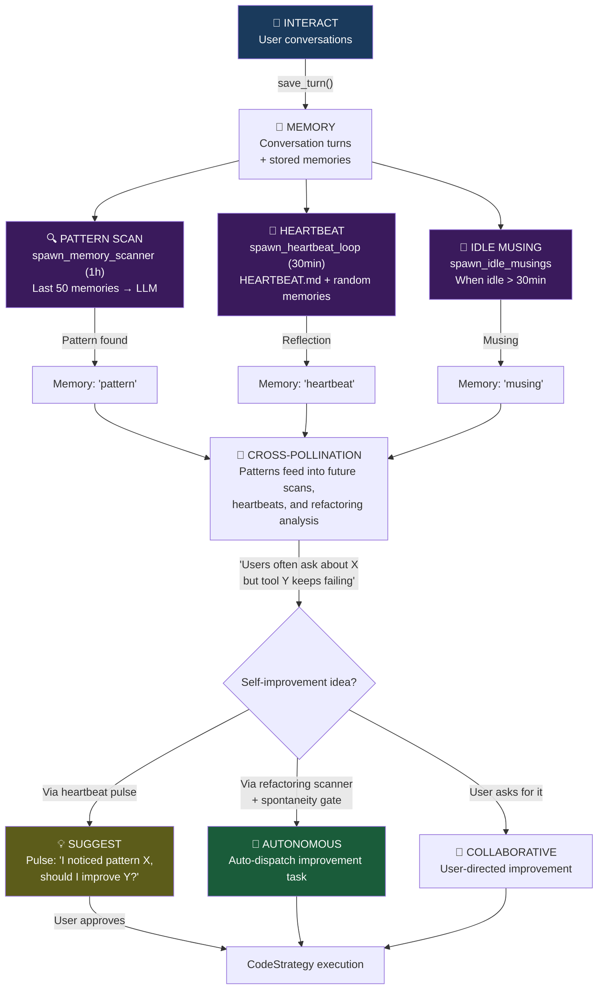
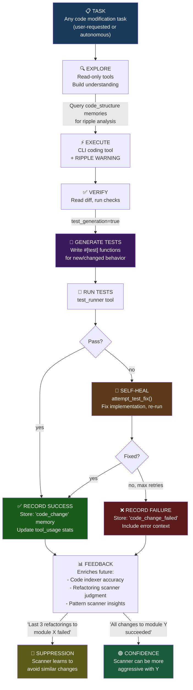
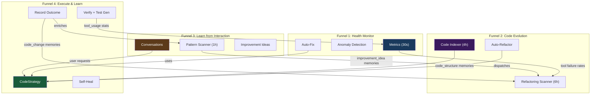

# Athena Self-Improvement Architecture

> Systems that think, adapt, and act with bounded autonomy.

## System Overview

## Target Operating Model (Spec-Driven)

Athena's long-horizon engineering loop should follow one explicit contract stack:

1. `Feature Contract` defines user outcome, scope, constraints, and acceptance criteria.
2. `Task Contracts` decompose a feature into a DAG of atomic tasks with dependencies.
3. `Execution Contract` runs each task through normalized CLI wrappers and deterministic retry/fallback policy.
4. `Eval Gate` scores plan/execution/tests/diff and blocks weak outcomes.
5. `Promotion Policy` applies risk-tier controls (low-risk auto-merge only; medium/high risk PR-only).

Key references:

- `docs/feature-contract-v1.md`
- `docs/task-contract-v1.md`
- `docs/execution-contract-v1.md`
- `docs/mission-contract.md`
- `docs/self-improvement-roadmap.md`

### Feature to Task DAG Scaling

To scale from task-level execution to feature-level delivery:

- each feature owns a single acceptance criteria set with stable IDs (for example, `AC-1`, `AC-2`)
- each task maps to at least one acceptance criterion
- dependencies are represented as a DAG (no cycles), so independent tasks can run in parallel
- feature completion is blocked until all acceptance IDs have passing evidence





## Background Process Timeline

```mermaid
gantt
    title Background Loop Scheduling (all require all_proactive=on)
    dateFormat X
    axisFormat %s

    section Always-On
    Conversation cleanup (1h)           :active, 0, 3600

    section Mood
    Mood drift (15min ±20%)             :active, 0, 900

    section Awareness
    Metrics collector (30s ±10%)        :crit, 0, 30

    section Reflection
    Heartbeat (30min ±20%)              :active, 0, 1800
    Idle check (5min ±30%)              :active, 0, 300
    Memory scanner (1h ±30%)            :active, 0, 3600

    section Self-Dev
    Code indexer (4h ±20%)              :active, 0, 14400
    Refactoring scanner (6h ±20%)       :active, 0, 21600

    section One-Shot
    Conversation re-entry (2h ±70%)     :done, 0, 7200
```



## Knob Dependency Tree



---

## The Four Self-Improvement Funnels

### Funnel 1: Health Monitor → Diagnose → Auto-Fix

**Purpose**: Athena notices something is wrong with herself and fixes it.



**What exists today**: Metrics collector runs, metrics injected into classify prompt. `attempt_test_fix()` is now wired into CodeStrategy self-heal when VERIFY output indicates test failures.

**What's missing**:
- No anomaly detection thresholds — metrics are collected but never compared against baselines
- No automatic dispatch when health degrades — only visible in classify prompt
- Self-heal policy is still shallow: one corrective cycle with heuristic triggering, not a deterministic multi-attempt policy
- No feedback: if a fix works, there's no record that suppresses the same alert

**How it should work**:
1. Metrics collector detects anomaly (tool failure rate spike, latency degradation, memory growth)
2. Stores anomaly as memory with category `"health_alert"`
3. If `self_dev_enabled` + spontaneity gate: dispatches diagnostic task to scout ghost
4. Scout identifies root cause → dispatches fix task to coder ghost
5. Coder runs CodeStrategy with `test_generation=true`
6. If VERIFY tests fail → `attempt_test_fix()` triggers corrective retry (currently single cycle)
7. On success: stores `"health_fix"` memory, emits pulse

---

### Funnel 2: Index → Analyze → Propose → Refactor

**Purpose**: Athena builds understanding of her own codebase and improves it structurally.



**What exists today**: Code indexer dispatches scout. Refactoring scanner queries memories + LLM analysis. Auto-dispatch with spontaneity gate.

**What's missing**:
- Code indexer relies on LLM compliance to store `code_structure` memories — no programmatic guarantee
- Refactoring scanner queries memories with `None` embedding (keyword-only fallback) — may miss relevant structure
- No failure feedback loop: same bad idea can be suggested every 6 hours forever
- Ripple analysis is heuristic (file extension matching), not informed by code_structure memories
- No incremental indexing — full rescan every 4h regardless of changes

**How it should work**:
1. Code indexer runs periodically, stores structural data as memories
2. Refactoring scanner queries structure + tool failure patterns + historical fixes
3. LLM identifies highest-impact opportunity
4. Stored as `refactoring_opportunity` memory (always)
5. If spontaneity allows: dispatched automatically to coder ghost
6. CodeStrategy uses code_structure memories for ripple analysis before EXECUTE
7. VERIFY phase writes tests + runs them
8. On failure: stores `"refactoring_failed"` memory with details → scanner learns to avoid similar ideas
9. On success: stores `"refactoring_done"` → enriches future analysis

---

### Funnel 3: Interact → Learn → Evolve

**Purpose**: Athena learns from conversations and proactively suggests or makes improvements.



**What exists today**: Memory scanner, heartbeat, idle musings all store reflections. Patterns accumulate. Heartbeat follows HEARTBEAT.md initiatives.

**What's missing**:
- No bridge from pattern memories to self-improvement tasks — patterns are stored but never trigger code changes
- Heartbeat can reflect on things but can't propose specific code improvements
- No mechanism to notice "users keep hitting the same bug" and auto-fix it
- HEARTBEAT.md could contain self-improvement initiatives but there's no example/template

**How it should work**:
1. Conversations and tool usage generate memories
2. Memory scanner identifies patterns ("tool X fails when Y", "users ask about Z frequently")
3. Heartbeat reflects on patterns + HEARTBEAT.md initiatives (e.g., "- Improve error messages", "- Add missing tests")
4. When a pattern has self-improvement implications:
   - Store with category `"improvement_idea"`
   - If heartbeat generates it: emit as low-urgency pulse (suggestion to user)
   - If pattern is high-confidence: feed into refactoring scanner's next analysis
5. Refactoring scanner considers improvement_idea memories alongside code_structure
6. Strong ideas get auto-dispatched; weaker ones wait for user confirmation

---

### Funnel 4: Execute → Verify → Self-Heal → Learn

**Purpose**: Every code change Athena makes feeds back into her understanding.



**What exists today**: CodeStrategy runs EXPLORE → EXECUTE → VERIFY. `test_generation` controls whether VERIFY can write tests. `attempt_test_fix()` is called in self-heal flow. Ripple warning is emitted.

**What's missing**:
- Self-heal retry policy is not deterministic across error classes and is limited to a single corrective cycle
- No success/failure recording after code changes — no feedback into future decisions
- Ripple analysis doesn't use code_structure memories, only heuristic file path matching
- No learning from outcomes: refactoring scanner can't distinguish "safe module" from "fragile module"
- No retry limit enforcement on self-heal

**How it should work**:
1. Every CodeStrategy execution records outcome as memory (`code_change` or `code_change_failed`)
2. VERIFY phase detects test failures → calls `attempt_test_fix()` using policy-driven retry limits
3. Success/failure memories feed into refactoring scanner's context
4. Scanner queries both `code_structure` and `code_change*` memories to understand what's safe to change
5. Modules with history of failed changes get lower confidence → less likely to be auto-refactored
6. Modules with clean change history → scanner can be more aggressive

---

## How The Funnels Interconnect



**Key cross-funnel data flows:**

| From | To | Data | Purpose |
|------|----|------|---------|
| Funnel 1 (Health) | Funnel 2 (Evolution) | tool failure rates | Scanner considers failing tools as refactoring targets |
| Funnel 1 (Health) | Funnel 4 (Execute) | dispatches fix task | Health anomaly triggers CodeStrategy |
| Funnel 2 (Evolution) | Funnel 4 (Execute) | dispatches refactoring | Scanner triggers CodeStrategy |
| Funnel 2 (Evolution) | Funnel 4 (Execute) | code_structure memories | Ripple analysis before EXECUTE |
| Funnel 3 (Learning) | Funnel 2 (Evolution) | improvement_idea memories | Patterns feed scanner analysis |
| Funnel 3 (Learning) | Funnel 4 (Execute) | user requests | Direct user-driven changes |
| Funnel 4 (Execute) | Funnel 1 (Health) | tool_usage stats | Test results update tool stats |
| Funnel 4 (Execute) | Funnel 2 (Evolution) | code_change memories | Outcomes inform future refactoring |
| Funnel 4 (Execute) | Funnel 3 (Learning) | code_change memories | Patterns from change history |

---

## Bounded Autonomy Ladder

Athena's self-improvement operates at 5 levels of autonomy, each with different gates:

```
Level 5: AUTONOMOUS REFACTORING
         Gate: all_proactive + self_dev + refactoring_scan + spontaneity
         Example: "Split tools.rs into tools/*.rs modules"

Level 4: AUTONOMOUS HEALTH FIX
         Gate: all_proactive + self_dev + anomaly threshold
         Example: "Fix WebFetchTool timeout configuration"

Level 3: PROACTIVE SUGGESTION
         Gate: all_proactive + heartbeat/memory_scan + pulse tolerance
         Example: "I noticed grep tool fails 30% of the time. Want me to look into it?"

Level 2: PATTERN STORAGE
         Gate: all_proactive + memory_scan/heartbeat
         Example: Stores "pattern: tool_X failure rate increasing" as memory

Level 1: PASSIVE OBSERVATION
         Gate: all_proactive + self_dev
         Example: Metrics collected, observer events emitted, no action
```

Each level requires all the gates of levels below it, plus its own.
The user controls maximum autonomy via knob combinations.

---

## Gap Summary: What Needs Wiring

| Gap | Severity | Funnel | What's Missing |
|-----|----------|--------|----------------|
| Self-heal retry policy is shallow/non-deterministic | **HIGH** | F4 | `attempt_test_fix()` is wired, but retry/fallback behavior is not policy-driven by stable error taxonomy |
| No optimizer loop (OpenEvolve-style) | **HIGH** | Cross-funnel | No prompt/skill mutation, tournament evaluation, or merge-best promotion loop over fixed tasks |
| No anomaly detection thresholds | **HIGH** | F1 | Metrics collected but never compared against baselines |
| No outcome recording | **HIGH** | F4 | Code changes don't store success/failure memories |
| No failure suppression | **MEDIUM** | F2 | Same bad refactoring idea can recur every 6h |
| `active_tasks` always 0 | **MEDIUM** | F1 | No tracking of concurrent autonomous tasks |
| `error_rate_1h` always 0 | **MEDIUM** | F1 | Rolling error window not implemented |
| Code indexer relies on LLM | **MEDIUM** | F2 | No programmatic guarantee memories are stored |
| Ripple uses heuristics only | **LOW** | F4 | Doesn't query code_structure memories |
| Streaming latency = TTFB only | **LOW** | F1 | Doesn't measure full generation time |
| Metrics not visible to ghosts | **LOW** | F1 | Only in classify prompt, not in task execution |
